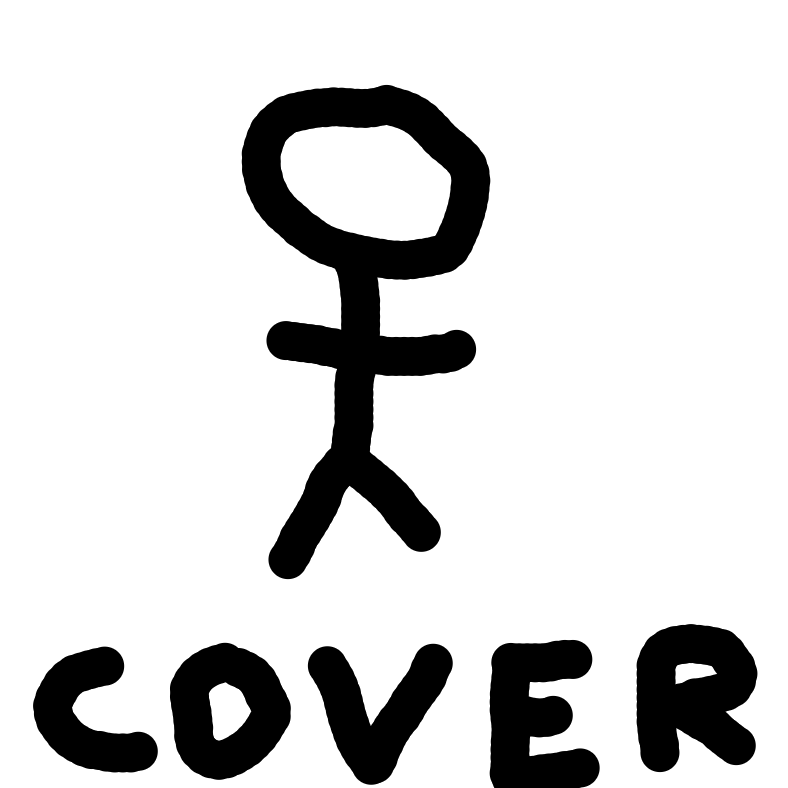

# Template deck
**Auteur :** Me  
**Categorie :** KARUTA  
**Type :** NORMAL  

My super karuta deck  

**Couverture :**  
  

## Liste des cartes :
### [01 - Affection Addiction](https://www.youtube.com/watch?v=UTcZHzDY3LU)
&emsp;**Anime :** [Vocaloid](https://anilist.co/anime/0) - MV  
&emsp;**Artiste(s) :** KAT  

  

### [02 - Young Girl A](https://www.youtube.com/watch?v=AqI97zHMoQw)
&emsp;**Anime :** [Vocaloid](https://anilist.co/anime/0) - MV  
&emsp;**Artiste(s) :** siinamota  

  

### [03 - Daidaidaidaidaikirai](https://www.youtube.com/watch?v=klIxS5o65C4)
&emsp;**Anime :** [Vocaloid](https://anilist.co/anime/0) - MV  
&emsp;**Artiste(s) :** Amala  

  

### [04 - Luka Luka★Night Fever](https://www.youtube.com/watch?v=ScSW9C3DF18)
&emsp;**Anime :** [Vocaloid](https://anilist.co/anime/0) - MV  
&emsp;**Artiste(s) :** Samfree  

  

### [05 - Rollin Girl](https://www.youtube.com/watch?v=vnw8zURAxkU)
&emsp;**Anime :** [Vocaloid](https://anilist.co/anime/0) - MV  
&emsp;**Artiste(s) :** wowaka  

  

### [06 - tententengokujigokugoku](https://www.youtube.com/watch?v=eTplxWaAD8o)
&emsp;**Anime :** [Vocaloid](https://anilist.co/anime/0) - MV  
&emsp;**Artiste(s) :** Aiobahn  

  

### [07 - Lost One's Weeping](https://www.youtube.com/watch?v=8oBV3jPTW4s)
&emsp;**Anime :** [Vocaloid](https://anilist.co/anime/0) - MV  
&emsp;**Artiste(s) :** Neru  

  

### [08 - Karma](https://www.youtube.com/watch?v=cMkJDPvJxdk)
&emsp;**Anime :** [Vocaloid](https://anilist.co/anime/0) - MV  
&emsp;**Artiste(s) :** Circus-P,Creep-P  

  

### [09 - Tokyo Teddy Bear](https://www.youtube.com/watch?v=eSI7RsjZy1E)
&emsp;**Anime :** [Vocaloid](https://anilist.co/anime/0) - MV  
&emsp;**Artiste(s) :** Neru  

  

### [10 - Butterfly on Your Right Shoulder - Len's version -](https://www.youtube.com/watch?v=5Qq2rk6x8h8)
&emsp;**Anime :** [Vocaloid](https://anilist.co/anime/0) - MV  
&emsp;**Artiste(s) :** noripy  

  

### [11 - Copycat](https://www.youtube.com/watch?v=Q_QEPrkwZ-Q)
&emsp;**Anime :** [Vocaloid](https://anilist.co/anime/0) - MV  
&emsp;**Artiste(s) :** Circus P  

  

### [12 - KING](https://www.youtube.com/watch?v=cm-l2h6GB8Q)
&emsp;**Anime :** [Vocaloid](https://anilist.co/anime/0) - MV  
&emsp;**Artiste(s) :** Kanaria  

  

### [13 - Lag train](https://www.youtube.com/watch?v=UnIhRpIT7nc)
&emsp;**Anime :** [Vocaloid](https://anilist.co/anime/0) - MV  
&emsp;**Artiste(s) :** inabakumori  

  

### [14 - Echo](https://www.youtube.com/watch?v=cQKGUgOfD8U)
&emsp;**Anime :** [Vocaloid](https://anilist.co/anime/0) - MV  
&emsp;**Artiste(s) :** Crusher  

  

### [15 - Ultra C](https://www.youtube.com/watch?v=7WryveKlyX8)
&emsp;**Anime :** [Vocaloid](https://anilist.co/anime/0) - MV  
&emsp;**Artiste(s) :** Giga,TeddyLoid  

  

### [16 - MATORYOSHKA](https://www.youtube.com/watch?v=HOz-9FzIDf0)
&emsp;**Anime :** [Vocaloid](https://anilist.co/anime/0) - MV  
&emsp;**Artiste(s) :** Kenshi Yonezu  

  

### [17 - Dear Doppelganger](https://www.youtube.com/watch?v=grdy6rLbQ-c)
&emsp;**Anime :** [Vocaloid](https://anilist.co/anime/0) - MV  
&emsp;**Artiste(s) :** kemu (ke-san β), GUMI  

  

### [18 - Doppelganger](https://www.youtube.com/watch?v=RD-g6a56XKU)
&emsp;**Anime :** [Vocaloid](https://anilist.co/anime/0) - MV  
&emsp;**Artiste(s) :** Harumaki Gohan, Hatsune Miku  

  

### [19 - Dune](https://www.youtube.com/watch?v=AS4q9yaWJkI)
&emsp;**Anime :** [Vocaloid](https://anilist.co/anime/0) - MV  
&emsp;**Artiste(s) :** Hachi, Hatsune Miku  

  

### [20 - Unknown Mother-Goose](https://www.youtube.com/watch?v=P_CSdxSGfaA)
&emsp;**Anime :** [Vocaloid](https://anilist.co/anime/0) - MV  
&emsp;**Artiste(s) :** wowaka, Hatsune Miku  

  

### [21 - Jigsaw puzzle](https://www.youtube.com/watch?v=ta9zslmSRqg)
&emsp;**Anime :** [Vocaloid](https://anilist.co/anime/0) - MV  
&emsp;**Artiste(s) :** Mafumafu  

  

### [22 - Kokoronashi](https://www.youtube.com/watch?v=3SkNrZnoK5w)
&emsp;**Anime :** [Vocaloid](https://anilist.co/anime/0) - MV  
&emsp;**Artiste(s) :** papiyon, GUMI  

  

### [23 - Vampire](https://www.youtube.com/watch?v=e1xCOsgWG0M)
&emsp;**Anime :** [Vocaloid](https://anilist.co/anime/0) - MV  
&emsp;**Artiste(s) :** DECO*27  

  

### [24 - Magical Girl and Chocolate](https://www.youtube.com/watch?v=T2kS1gAbxhc)
&emsp;**Anime :** [Vocaloid](https://anilist.co/anime/0) - MV  
&emsp;**Artiste(s) :** Pinocchiop  

  

### [25 - Super Nuko ni Narenkatta](https://www.youtube.com/watch?v=KkmFgOvttrk)
&emsp;**Anime :** [Vocaloid](https://anilist.co/anime/0) - MV  
&emsp;**Artiste(s) :** Mafumafu  

  

### [26 - Inochi ni Kirawarete iru](https://www.youtube.com/watch?v=0HYm60Mjm0k)
&emsp;**Anime :** [Vocaloid](https://anilist.co/anime/0) - MV  
&emsp;**Artiste(s) :** Kanzaki Iori  

  

### [27 - Proof Geometric Construction Can Solve All Love Affairs](https://www.youtube.com/watch?v=yoHR8qwuqmY)
&emsp;**Anime :** [Vocaloid](https://anilist.co/anime/0) - MV  
&emsp;**Artiste(s) :** manbo-p  

  

### [28 - Remote Control](https://www.youtube.com/watch?v=1st0XSY0VKQ)
&emsp;**Anime :** [Vocaloid](https://anilist.co/anime/0) - MV  
&emsp;**Artiste(s) :** Jesus-P, Kagamine Rin , Kagamine Len  

  

### [29 - QUEEN](https://www.youtube.com/watch?v=KFCaSz_yYCM)
&emsp;**Anime :** [Vocaloid](https://anilist.co/anime/0) - MV  
&emsp;**Artiste(s) :** Kanaria  

  

### [30 - Hibana](https://www.youtube.com/watch?v=hxSg2Ioz3LM)
&emsp;**Anime :** [Vocaloid](https://anilist.co/anime/0) - MV  
&emsp;**Artiste(s) :** DECO*27  

  

